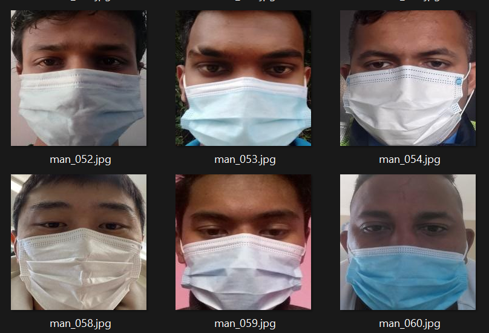
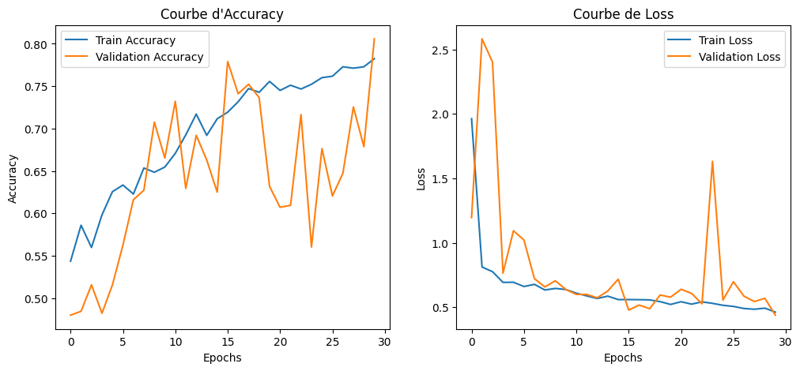

# Gender Detection on masked faces using CNN

## 📌 Project Overview
This project implements a Convolutional Neural Network (CNN) for gender classification based on facial images. The model is trained on a dataset containing images of individuals wearing masks. The goal is to predict whether the person is **Male** or **Female** using deep learning techniques.

## 📂 Project Structure
```
├── Dataset/                # Folder containing images
│   ├── Female/             # Images of female individuals
│   ├── Male/               # Images of male individuals
├── CNN_Model.ipynb         # Jupyter Notebook containing training and evaluation
├── plot_accuracy_loss.png  # plot of accuracy and loss
├── masked_sample           # sample of images used for training
├── requirements.txt        # Dependencies required to run the project
└── README.md               # Project documentation
```

## 🚀 Getting Started
### 1️⃣ Clone the Repository
```bash
git clone https://github.com/MohaYass92/Gender-Detection-on-Masked-Faces-with-CNN
cd Gender-Detection-on-Masked-Faces-with-CNN
```

### 2️⃣ Install Dependencies
Ensure you have Python 3.x installed, then run:
```bash
pip install -r requirements.txt
```

### 3️⃣ Open and Run the Notebook
You can run the Jupyter Notebook in **Google Colab** or locally:
```bash
jupyter notebook
```
Then open `CNN_Model.ipynb` and execute the cell.

## 🏋️ Training the Model
The notebook contain only one and it includes:
- Load and preprocess the dataset
- Define and train a CNN model using TensorFlow/Keras
- Evaluate the model on the dataset
- Save the trained model for later use

## 📦 Dataset
The dataset contains images of masked individuals, divided into two folders:
- `Female/`
- `Male/`
## Example of Masked Image


Ensure that your dataset is correctly placed before running the notebook.

## 💾 Saving and Loading the Model
The trained model is saved in `.keras` format. You can load and use it later:
```python
from tensorflow.keras.models import load_model
model = load_model('CNN_Model.keras')
```
## 📊 Model Performance

The training accuracy and loss curves are shown below:




## 📜 License
This project is open-source. Feel free to modify and improve it!

